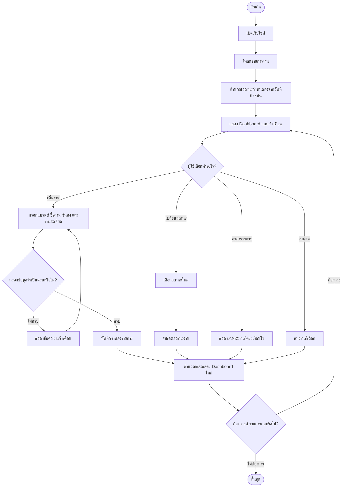

# Flowchart — Influencer WorkMate

```mermaid
flowchart TD
    A([เริ่มต้น]) --> B[เปิดเว็บไซต์]
    B --> C[โหลดรายการงาน]
    C --> D[คำนวณสถานะกำหนดส่งจากวันที่ปัจจุบัน]
    D --> E[แสดง Dashboard และแจ้งเตือน]
    E --> F{ผู้ใช้เลือกทำอะไร?}
    F -->|เพิ่มงาน| G[กรอกแบรนด์ ชื่องาน วันส่ง และรายละเอียด]
    G --> H{กรอกข้อมูลจำเป็นครบหรือไม่?}
    H -->|ไม่ครบ| I[แสดงข้อความแจ้งเตือน]
    I --> G
    H -->|ครบ| J[บันทึกงานลงรายการ]
    F -->|เปลี่ยนสถานะ| K[เลือกสถานะใหม่]
    K --> L[อัปเดตสถานะงาน]
    F -->|กรองรายการ| M[แสดงเฉพาะงานที่ตรงเงื่อนไข]
    F -->|ลบงาน| N[ลบงานที่เลือก]
    J --> O[คำนวณและแสดง Dashboard ใหม่]
    L --> O
    M --> O
    N --> O
    O --> P{ต้องการทำรายการต่อหรือไม่?}
    P -->|ต้องการ| E
    P -->|ไม่ต้องการ| Q([สิ้นสุด])
```
